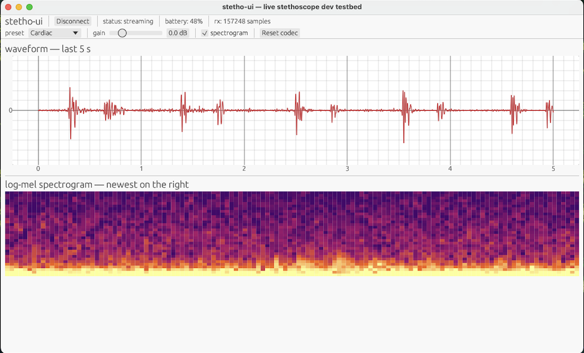

# openstetho

Pure-Rust toolkit for BLE digital stethoscopes — capture, DSP,
log-mel spectrograms, and on-device murmur classification on the
Apple Neural Engine.

Independent project. Trademarks (Eko, Eko Core, Littmann CORE) used
descriptively to identify the hardware this toolkit interoperates
with. Not a medical device — see [`DISCLAIMER.md`](DISCLAIMER.md).



## Model status

Current murmur models are experimental and should not be treated as
accurate. They are trained on public phonocardiogram datasets collected
with different microphones, acoustic paths, gain/filter settings, patient
populations, and labeling protocols than compatible Eko/Littmann devices.
That domain mismatch can dominate model output even when the DSP pipeline
is working correctly.

The useful role of this toolkit today is to capture device audio, make the
BLE/codec/DSP path reproducible, and provide a Core ML export/inference
loop that can support future model development on properly matched data.

Model artifacts are intentionally not committed to git. The current
`MurmurCNN` checkpoint is about 300 KB as a PyTorch `state_dict`; exported
Core ML packages are expected to be low single-digit MB. `stetho-ui` can
download a zipped Core ML package from a release asset; set
`OPENSTETHO_MODEL_DOWNLOAD_URL` to override the default latest-release URL
and `OPENSTETHO_MODEL_DOWNLOAD_DIR` to override the local destination.
The default button URL works after a GitHub release asset named
`MurmurCNN.mlpackage.zip` exists. Package an exported model with:

```bash
scripts/package_model_release.sh model/runs/v1/MurmurCNN.mlpackage
```

## Crates

- **`stetho-core`** — BLE GATT, IMA-ADPCM decoder, biquad DSP,
  Slaney log-mel spectrogram. Pure DSP from public formulas.
- **`stetho-cli`** — `stetho` binary: `scan`, `connect`, `stream`,
  `capture`, `decode-hex`.
- **`stetho-ui`** — egui live dev viewer: waveform + mel-spec + on-
  device Core ML inference.
- **`model/`** — Python pipeline. Trains a small Conv2D classifier
  on CirCor 2022 by default and exports a Core ML
  `.mlpackage` for the Apple Neural Engine.

## Quick start

Requires macOS, Rust, and Python 3.12 with `uv`.

```bash
# Scan for compatible devices
cargo run -p stetho-cli --release -- scan --seconds 10

# Capture 30 s to WAV + raw hex
cargo run -p stetho-cli --release -- capture "eko core" --seconds 30 \
    --out /tmp/capture

# Live dev viewer
cargo run -p stetho-ui --release
```

Train from public data:

```bash
bash scripts/download_circor.sh
cd model && uv sync
uv run python -m openstetho_model.train --data ../data/circor \
    --epochs 30 --out runs/v1
uv run python -m openstetho_model.export --checkpoint runs/v1/best.pt \
    --out runs/v1/MurmurCNN.mlpackage --target macOS13 --verify
```

## Provenance + license

DSP, protocol observations, and dataset attributions are documented
in [`PROVENANCE.md`](PROVENANCE.md). Code is [Apache 2.0](LICENSE).
Packaged binaries should include applicable dependency notices; see
[`THIRD_PARTY_NOTICES.md`](THIRD_PARTY_NOTICES.md).
